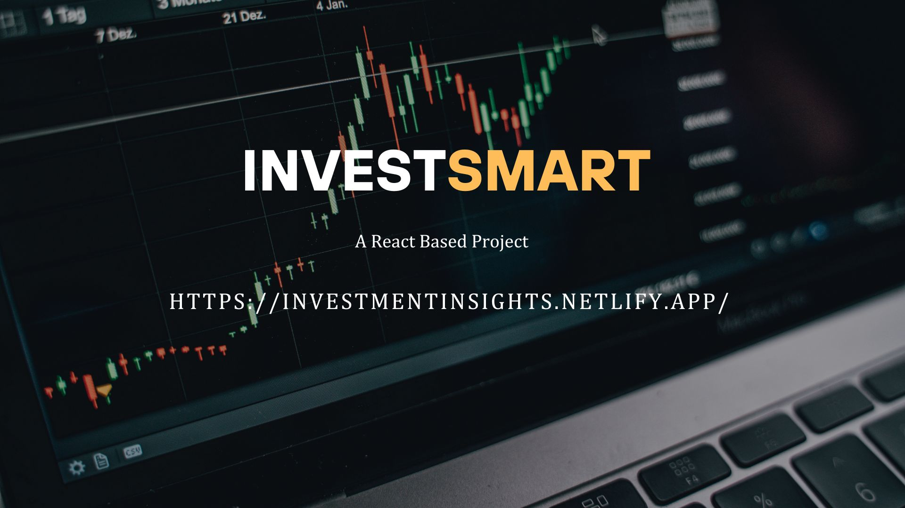

<h1 align="center">
    
</h1>


<h1 align="center">
  <a href="https://investsmartz.netlify.app/">Invest Smart</a>
</h1>

<h3 align="center"></h3>

<p align="center">

  

  <a href="https://github.com/Mominuddin07/CryptoTracker">
    
  </a>


  <a href="https://github.com/Mominuddin07/">
    
  </a>
</p>


<h4 align="center"> 
	 Status: Finished
</h4>

<p align="center">
 <a href="#about">About</a> •
 <a href="#features">Features</a> •
 <a href="#how-it-works">How it works</a> • 
 <a href="#tech-stack">Tech Stack</a> •  
 <a href="#author">Author</a> 
</p>

## About

PROJECT - Investment Insights is a React-based web app that provides real-time market data through a dashboard. It uses Tailwind for design and Firebase for the backend and APIs, helping users track trends and prices easily.

---

## Features

- [x] Dashboard Insights
- [x] Contact Form with EmailJS
- [x] Firebase Authentication
- [x] Pagination and search functionality for coins
- [x] Mobile responsive design
- [x] Tradingview Chart
- [x] Real-time cryptocurrency prices and trends
- [x] View detailed coin information

---

## How it works

1. **Frontend** (this repository): Built using React, Tailwind CSS, and Axios to fetch data from the CoinGecko API.
2. **Backend** (external or API service): Axios to fetch data from the CoinGecko API and Tradingview and Firebase for user Authentication . 

### Pre-requisites

Before you begin, make sure you have the following tools installed on your machine:
- [Git](https://git-scm.com)
- [Node.js](https://nodejs.org/en/)
- [VSCode](https://code.visualstudio.com/) (or any code editor)

#### Running the web application (Frontend)

```bash
# Clone this repository
$ git clone git@github.com:Investment-insights/.git

# Navigate to the project folder
$ cd Investment-insights

# Install dependencies
$ npm install or npm i 

# Start the application
$ npm start

# The application will run on http://localhost:3000

```

---

## Tech Stack

The following tools were used in the construction of the project:

#### **Platform** 

- **[React Router Dom](https://github.com/ReactTraining/react-router/tree/master/packages/react-router-dom)**
- **[React Icons](https://react-icons.github.io/react-icons/)**
- **[Axios](https://github.com/axios/axios)**
- **[React Redux](https://github.com/reduxjs/react-redux)**
- **[react-device-detect](https://github.com/duskload/react-device-detect)**

### **Styling & UI**
- **[Tailwind CSS](https://tailwindcss.com/)** – Utility-first CSS framework for styling  

### **Backend & Database**
- **[Firebase](https://firebase.google.com/)** – Authentication, Firestore, Hosting, and APIs  

### **Utilities & APIs**
- **[EmailJS](https://www.emailjs.com/)** – Contact form functionality  

#### **Utils**

- **API**: [CoinGecko API](https://www.coingecko.com/en/api) → Provides real-time cryptocurrency data including prices, market trends, and more.
- **API**: [TradingView](https://www.tradingview.com/widget/) → Offers charting solutions, market data, and financial analysis tools for integration into applications.
- **Editor**: [Visual Studio Code](https://code.visualstudio.com/) → A code editor used for writing and debugging the application.


---

## Author

<a href="https://www.linkedin.com/in/mohammed-mominuddin-350180259/">

 <br />
 <p><b>Mohammed Mominuddin</b></p></a>
 
[](https://www.linkedin.com/in/mohammed-mominuddin-350180259/)


---


## Learn More

This project was created using React .

For more information about React, refer to the official documentation.

You can also learn more about React in the React documentation.
